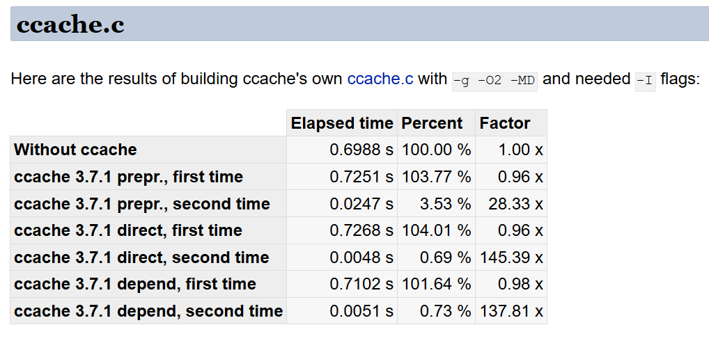
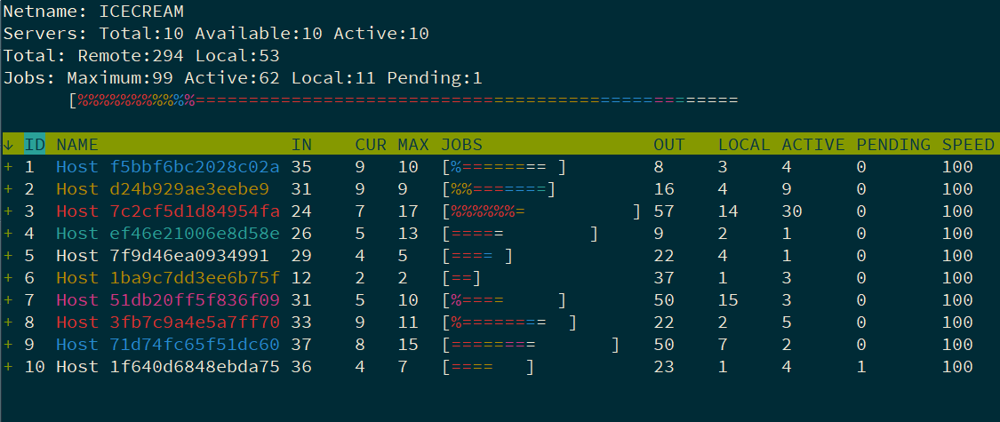

title: Building and Packaging Modern C++
class: wrapper <!-- , animation-fade -->
layout: true

---

class: wrapper, center, middle

# {{title}}

---

class: wrapper, center, middle

# Piotr Gaczkowski


<https://github.com/DoomHammer> | [@doomhammerng](https://twitter.com/doomhammerng)

<https://doomhammer.info>

---

class: wrapper, center, middle

# Adrian Ostrowski


<https://github.com/aostrowski> | [@adr_ostrowski](https://twitter.com/adr_ostrowski)


---

background-image: url(img/samuel-regan-asante-g9A2llpDObU-unsplash.jpg)

---

class: wrapper, center, middle

# Speeding up Builds

---

class: wrapper, center, middle

# CCache

https://ccache.dev/

???
In essence: compiler cache

---

# CCache - features

- much faster recompilation 
???
- supports C, C++, Objective-C, Objective-C++, CUDA & assembly
--

- compression
--

- statistics
???
- low overhead
- checksums for correctness since 4.0
--

- silent fallback in unsupported cases
--

- easy integration
--

- support for C++20's modules
???
- modules - doc mentions Clang only; require settings a few options

---

# CCache - supported environment

- works on Linux and macOS, other Unixes, and Windows
- supports GCC, Clang and NVCC
- MSVC support underway (PR [#506](https://github.com/ccache/ccache/pull/506))

---

exclude: true

# CCache - usage

```
ccache [flag]
ccache [[compiler] [flags ...]]
compiler [flags ...]
```
???
First: for managing ccache itself, e.g. stats
2 & 3: for compiling
--

exclude: true

or via build systems

---

# CCache - installation

- Windows:
  - just use binaries from GitHub
- Others:
  - system package manager - usually not the latest version
  - `brew install ccache`
  - build from sources (CMake)

---

class: wrapper, center, middle

# Intermission: Brew

 <!-- TODO: can we use this image legally-speaking? -->

https://brew.sh/

???
Package manager for macOS and Linux

Why use it?
- all files installed in one subtree - clean removal if needed
- plethora of packages in recent versions
  - Snap has old and unofficial CCache (3.7 vs brew's 4.2)

Scoop for Windows

Python has C++ software too, e. g. CMake (`pip install cmake`)

---

# CCache - usage

- invoke manually
```
ccache <compiler> <compiler_args>
```
--

- invoke via symbolic links masquerading the compilers
???
masqerading: we'll show that in a sec
--

- integrate with build systems

---

# CCache - masquerading compilers

To ensure CCache is used by default:
--

1. Run:
```
cp ccache /usr/local/bin/
ln -s ccache /usr/local/bin/gcc
ln -s ccache /usr/local/bin/g++
ln -s ccache /usr/local/bin/cc
ln -s ccache /usr/local/bin/c++
```
???
When invoked, ccache deduces orig. compiler from $0
--

2. Put `/usr/local/bin` early in `PATH`

---

# CCache - configuration

- many environment variables 
- corresponding settings in `ccache.conf`
???
In most cases defaults work well.

---

# CCache - configuration, cont'd

- cache size and location
- behavior: `sloppiness`, preprocessing, etc.
- compiler specific, e. g. `prefix_command`
- read only mode
- debugging and logging

???
Cache size - one thing worth increasing.

Sloppiness:
- pretty strict by default -> less false hits
- allows to use ctimes/mtimes instead of file contents
- needed for modules and precompiled headers

---

# CCache - integrating with CMake

Available since CMake 3.4
--

```
-DCMAKE_CXX_COMPILER_LAUNCHER=ccache
```
--

```
find_program(CCACHE_PROGRAM ccache)
if(CCACHE_PROGRAM)
  set_property(GLOBAL PROPERTY RULE_LAUNCH_COMPILE "${CCACHE_PROGRAM}")
endif()
```

???
RULE_LAUNCH_LINK - no use, CCache doesn't support linking

---

# CCache - sharing cache

- possible on same machine and using a network storage
--

- for locations afar, consider providing their own caches
--

- users need to be in same group
--

- in config, provide:

```
cache_size = 100G
base_dir = /home/current/user/
cache_dir = /network/storage/path
hash_dir = false
temporary_dir = /some/local/dir/like/tmp
umask = 002
```

???

- `base_dir` - allows different users to share cache
- `hash_dir` - paths in debug symbols
- `temporary_dir` - faster + helps avoid some bugs
- To share between OS-es: set `sloppiness` to `system_headers`

---

# How much does it help?

A lot!

Personal experience: 12 minutes &rarr; less than 30 seconds

---

# How much does it help - cont'd



???

- Preprocessor - first run preprocessor, then hash results
- Direct - hash source file and include files directly. If miss, goto preprocessor.
- Depend - like direct, but doesn't goto preproc. on miss. 
  - depends on compiler's `-MD` or `-MMD`
  - Great for dist. builds (reduce local overhead)

---

class: wrapper, center, middle

# What else a developer needs?

---

background-image: url(img/lama-roscu-Wpg3Qm0zaGk-unsplash.jpg)

---

class: wrapper, center, middle

# Icecream

https://github.com/icecc/icecream

???
fork of distcc - with a central server that chooses fastest free server

---

# Icecream - features

- scheduler 
--

  - only uses free resources on machines
--

  - allows good perf on heterogeneous environments
--

  - allows some machines to be off during compilation
--

- remote cross compiling
???
Automatically sends toolchain to remote
--

- monitoring

---

exclude: true

# Monitoring - Icemon

https://github.com/icecc/icemon

---

# Monitoring - Sundae

https://github.com/JPEWdev/icecream-sundae


---

# Monitoring - Sundae - cont'd



???

% - local job
= - remote job

---

# Icecream - supported environments

- Linux
- macOS
- FreeBSD
- Cygwin

No native Windows :(

---

background-image: url(img/icecream.jpg)

---

# Icecream - installation

- developers recommend using distro's package
  - `sudo apt install icecc`
  - `sudo apt install icecc-scheduler`
  - `sudo apt install icecream-sundae`

???
- `icecc` has client and daemon (both required for remote builds)
- scheduler - on one host only (two possible, automatic fallback)
- sundae - optional
---

# Icecream - configuration

- firewall
  - TCP: 10245, 8765, 8766
  - UDP: 8765
- other defaults should work fine
- persistent connections:
  - `--scheduler-host` for daemon
  - `--persistent-client-connection` for scheduler
???

icecc must be in your path - that's all.
Network should be fast. Avoid far away nodes.
Scheduler should have dedicated resources - sensitive to latency.

---

# Icecream - configuration, cont'd

To ensure Icecream is always used by default, put

```
/usr/lib/icecc/bin
```

early in your `PATH`.

---

# Icecream - integrating with CMake

```
find_program(ICECC_PROGRAM icecc)
if(ICECC_PROGRAM)
  set_property(GLOBAL PROPERTY RULE_LAUNCH_COMPILE "${ICECC_PROGRAM}")
endif()
```

---

# Combining CCache and Icecream

- Your `ccache.conf` file must contain:
```
prefix_command=icecc
```
--

- CCache should come before IceCC in `PATH`

---

# How much does it help?


???
- Many cases show at least 20% faster builds
- More responsive local machine

https://bugzilla.mozilla.org/show_bug.cgi?id=927952

---

class: wrapper, center, middle

# Noteworthy alternatives

---

# IncrediBuild

- distributed building for Windows and Linux
- commercial

https://www.incredibuild.com/

---

# `sccache`

- Mozilla's `ccache`-like compiler cache
- built-in `icecream`-style distributed compilation
- supports C, C++, Rust, and NVCC
- on Windows, Linux and macOS

Not production ready yet (current version: 0.2.15)

https://github.com/mozilla/sccache

---

exclude: true

# Bazel

https://bazel.build/

---

exclude: true

# C++20's Modules

TODO

---

class: center, middle, split50

# Hungry for more?

.left-pane[

]
.right-pane[
.left[
Our brand new book is coming out!

Featuring:
- More on building and packaging
- Designing quality software
- Leveraging C++20 features
- Microservices and cloud-native C++

Available from March 12th on 

And from April 9th on Amazon
]
]
---

# Questions?

---

class: center, middle, split50

# Thank you!

.left-pane[
  

  <https://github.com/DoomHammer>

  <https://doomhammer.info>
]
.right-pane[
  

  <https://github.com/aostrowski>

  
]

### <https://doomhammer.info/talks/cppeurope2021>

---

# Attributions

- _Building Site_ photo by <a href="https://unsplash.com/@fkaregan?utm_source=unsplash&amp;utm_medium=referral&amp;utm_content=creditCopyText">Samuel Regan-Asante</a> on <a href="https://unsplash.com/?utm_source=unsplash&amp;utm_medium=referral&amp;utm_content=creditCopyText">Unsplash</a>
- _Icecream rainbow_ photo by <a href="https://unsplash.com/@lamaroscu?utm_source=unsplash&amp;utm_medium=referral&amp;utm_content=creditCopyText">Lama Roscu</a> on <a href="https://unsplash.com/s/photos/icecream?utm_source=unsplash&amp;utm_medium=referral&amp;utm_content=creditCopyText">Unsplash</a>
- Sundae image by <a href="https://pixabay.com/users/blende12-201217/?utm_source=link-attribution&amp;utm_medium=referral&amp;utm_campaign=image&amp;utm_content=2300531">Gerhard G.</a> from <a href="https://pixabay.com/?utm_source=link-attribution&amp;utm_medium=referral&amp;utm_campaign=image&amp;utm_content=2300531">Pixabay</a>
